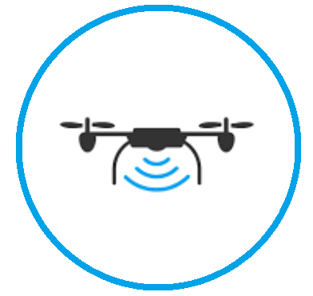
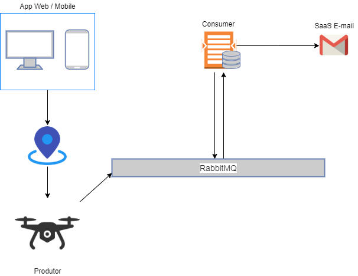

# 37SCJ-Drone-Project
Projeto para disciplina Integrations &amp; Development Tools (FIAP)

Solução para o agronegócio que coleta dados via sensores de temperatura e umidade. Esses sensores ficarão instalados em um drone com uma altíssima autonomia
de energia, pois conta com pequenos, porém muito eficientes painéis fotovoltaicos.

##  Pré-requisitos para execução do projeto
- Tecnologias necessárias.

  1- Para executar o projeto é necessário ter instalado Java SE Development Kit versão 11.
  
  2- Utilizar uma IDE para execução backend e frontend.

---
## Topologia

## Download do projeto

- Baixar o projeto: `$ git clone https://github.com/igor-fga/37SCJ-Drone-Project.git`

---

## Instalação e execução do projeto "Consumer"

- Importar o projeto (Ex. Eclipse)
  
  1- No Eclipse, selecione **File > Import...**.
  
  2- Na janela de importação, expandir Maven, selecione **Existing Maven Projects**, e clicar **Next**.
  
  3- Clicar em **Browse** e entre na pasta do projeto **Consumer**, onde contém o **pom.xml** que você deseja importar.
  
  4- Clicar em **Finish**. O Eclipse vai importar o projeto e iniciar o download dos recursos requeridos.
  
  5- Selecione **src/main/java** e entre no Package **br.com.fiap.consumermicroservice.bo** e abra a classe Java **MailBO**
  
  6- Alterar a linha 38, referente ao destinatário do e-mail e informe seu e-mail e salve a alteração.
  
  7- Entre no Package **br.com.fiap.consumermicroservice.main** e clique na classe Java **Consumer** e clique em **Run**.
  
---

## Instalação e execução do projeto "Producer"

- Importar o projeto (Ex. Eclipse)
  
  1- No Eclipse, selecione **File > Import...**.
  
  2- Na janela de importação, expandir Maven, selecione **Existing Maven Projects**, e clicar **Next**.
  
  3- Clicar em **Browse** e entre na pasta do projeto **Producer/drone**, onde contém o **pom.xml** que você deseja importar.
  
  4- Clicar em **Finish**. O Eclipse vai importar o projeto e iniciar o download dos recursos requeridos.
  
  5- Entre no Package **br.com.agronegocio.drone* e clique na classe Java **DroneApplication** e clique em **Run**.
  
---

## Instalação e execução do projeto "Webapp"

- Importar o projeto (Ex. Vscode)
  
  1- No Vscode, selecione **File > Open folder...**.
  
  2- Na janela de importação, selecionar a pasta Webapp.
  
  3- No Vscode clicar no menu Terminal e na opção New terminal.
  
  4- No terminal, baixe as dependências do projeto digitando o comando "npm install" e pressionar enter.  
  
  5- Ainda no terminal, execute a inicialização do projeto com o comando "npm start".
  
  6- O navegador irá abrir automaticamente a URL
