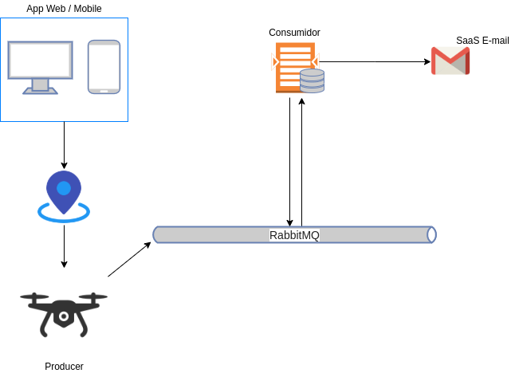

# 37SCJ-Drone-Project
Projeto para disciplina Integrations &amp; Development Tools (FIAP)

##  Pré-requisitos para execução do projeto
- Tecnologias necessárias.

  1- Para executar o projeto é necessário ter instalado Java SE Development Kit.
  
  2- Utilizar uma IDE para execução.

---
## Topologia

## Instalação e execução do projeto

1- Baixar o projeto: `$ git clone https://github.com/igor-fga/37SCJ-Drone-Project.git`

---
